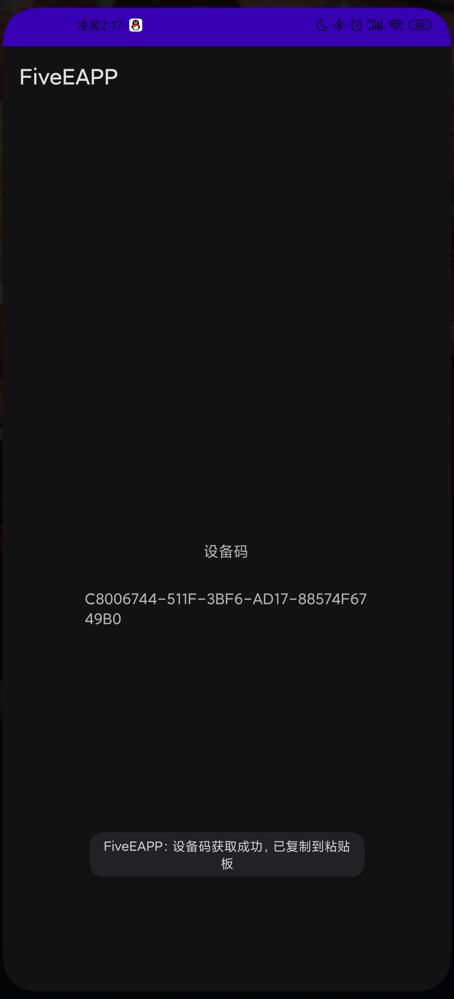
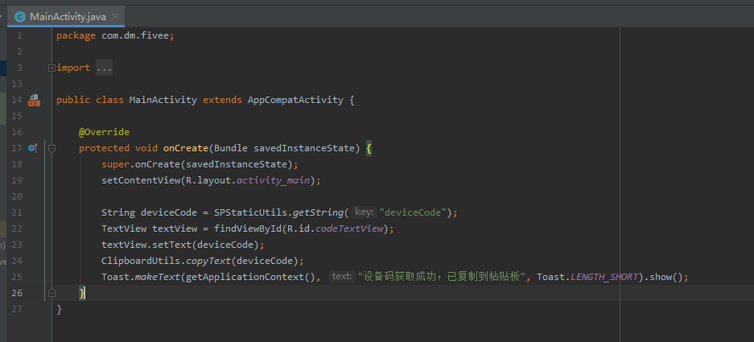
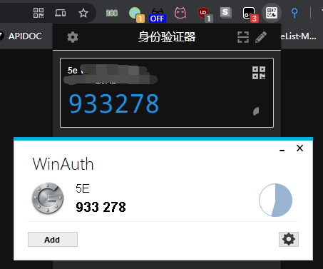

# 5E CSGO平台优先登录验证码提取 #

懒得打开手机看验证码所以有了此项目:D

演示站：http://139.159.237.182:8080/index.html 感谢匿名网友提供

WEB源码来自：https://github.com/ElementUI/element-starter

# Usage
```
mvn install

java -jar fiveE-0.0.2-SNAPSHOT.jar

API: http://127.0.0.1:8080/api/getAuth?acc=5e账号（必填，用于刷新token）&pswd=5e密码（同上）&device_code=APP里提取设备码

result:

{
    "code": 200,
    "msg": "成功",
    "data": {
        "code": "162072",//当前登录验证码
        "google_key": "MJ7UKL6XDHPKP2OI"//谷歌验证器密钥
    }
}

WEB: http://127.0.0.1:8080/index.html

如何从APP里提取设备码
方法一：
1.安装5e官方APP
2.进行人脸认证且保证手机上可以看到登陆验证码
3.覆盖安装 5E设备码提取.apk 注：如提示签名问题请卸载官方app后使用本项目提供的5E重签名版.apk，然后从第2步重新开始
4.不出意外 5E设备码提取的APP界面上会显示设备码

方法二（机器必须有ROOT权限）：
打开/data/data/com.fiveplay/shared_prefs/spUtils.xml，xml中deviceCode就是设备码了

注：设备码必须是已人脸认证的设备上提取的才有用。
（逆向时有看到生成设备码的逻辑，忘了在哪了，有空再补上）

```


设备提取码APP的整体源码就懒得发了5行代码解决问题



## Windows

### Chrome 插件

https://chrome.google.com/webstore/detail/authenticator/bhghoamapcdpbohphigoooaddinpkbai

### 支持谷歌身份验证的 Winauth

https://winauth.github.io/winauth/download.html



TODO
- [x] API 获取密钥及当前验证码
- [x] WEB界面
- [x] 演示站
